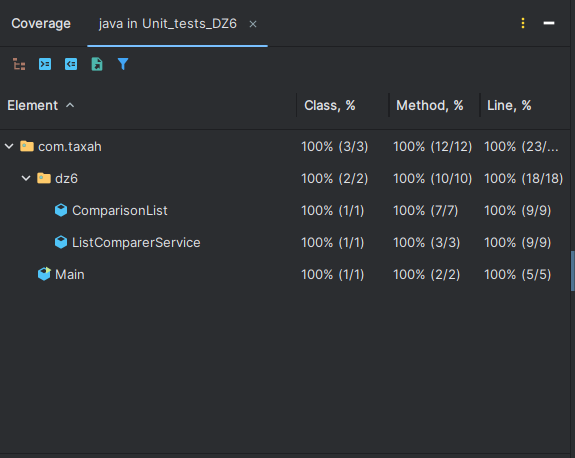
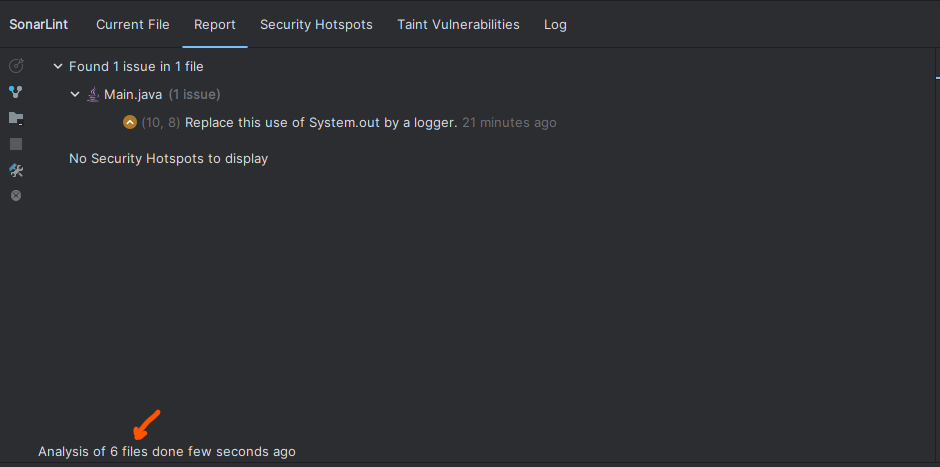

Задание 1. Создайте программу Java, которая принимает два списка чисел и выполняет следующие действия:
a. Рассчитывает среднее значение каждого списка.
b. Сравнивает эти средние значения и выводит соответствующее сообщение:
- Первый список имеет большее среднее значение"", если среднее значение первого списка больше.
- Второй список имеет большее среднее значение"", если среднее значение второго списка больше.
- Средние значения равны"", если средние значения списков равны.
  
- 
Важно:
-  Приложение должно быть написано в соответствии с принципами объектно-ориентированного программирования.
-  Используйте JUnit для написания тестов, которые проверяют правильность работы программы. Тесты должны учитывать различные сценарии использования вашего приложения.
-  Используйте SonarLint для проверки качества кода.
-  Сгенерируйте отчет о покрытии кода тестами. Ваша цель - достичь минимум 90% покрытия.

*Формат и требования к сдаче: *
Отчет о выполнении этого задания должен включать в себя следующие элементы:
- Код программы
- Код тестов
- Отчет pylint/Checkstyle
- Отчет о покрытии тестами
- Объяснение того, какие сценарии покрыты тестами и почему вы выбрали именно эти сценарии.
  
Путь к файлам программы и тестов сюда ->   [src](src)

Отчет по покрытию:

Отчет SonarLint:

P.S Medium impact на команду вывода в консоль System.out.println()

### Письменный ответ: 
Так как задача решается просто и в ней мало классов, 
сущность ComparisonList и сервис ListComparerService, 
тут можно использовать 2 вида тестирования 
- Unit тестирование для самих классов
- и End-to-end тестирование для всей программы

Так как в них нет зависимостей от других классов или базы данных, 
нет необходимости использовать Мокирование и другие виды заглушек, такие как fake, stub, spy, dummy 
а также нет необходимости поводить интеграционное тестирование для проверки зависимостей

#### При тестировании класса ComparisonList:

Класс является оберткой для списка целых чисел, в котором есть необходимость Unit тестирования
стандартного функционала 
- добавления в список 
- получение списка
- получение итератора
- получение stream
- строковый вывод списка

#### При тестировании класса ListComparerService:

Класс является сервисом для сравнения средних значений чисел двух списков,
который содержит 2 основных метода по ТЗ:

1. Это метод расчета среднего значения элементов списка,
тут всё просто мы проверяем корректность расчета среднего значения списка
и тест, что если список пуст, ошибки нет и среднее значение равно 0
2. Это метод сравнения средних значений списка,
тут уже посложнее, так как в методе присутствует ветвление,
нужно подвергнуть тестированию каждое возможное состояние,
поэтому тут понадобилось три теста, когда среднее значение элементов первого
больше чем второго, когда среднее значение элементов первого
меньше чем у второго, и когда средние значения элементов равны

#### Следующим тестированием стало сквозное, 
где проверяется уже полный цикл работы программы.
Для этого используем вызов метода Main и перехватываем вывод результата
в консоль, а затем сравниваем с предполагаемым результатом от заданных параметров
